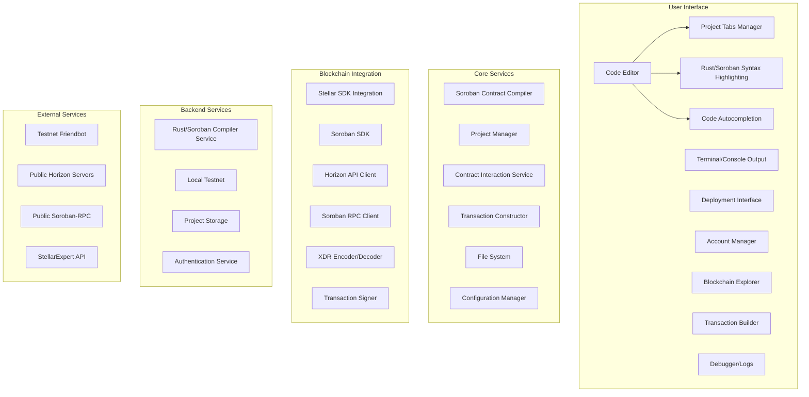

```mermaid
graph TD
    A[stellar-ide/] --> B[public/]
    B --> B1[favicon.ico]
    B --> B2[assets/]
    B2 --> B3[images/]
    B3 --> B4[logo.svg]
    B3 --> B5[space-bg.jpg]

    A --> C[src/]
    C --> C1["main.jsx (Entry point)"]
    C --> C2["App.jsx (Main App)"]
    C --> C3["index.css (Global styles)"]
    C --> D[components/]
    D --> D1["common/ (UI Components)"]
    D1 --> D11[Button.jsx]
    D1 --> D12[Dropdown.jsx]
    D1 --> D13[Modal.jsx]
    D1 --> D14[Tooltip.jsx]
    D1 --> D15[Tabs.jsx]
    D --> D2["layout/ (Layout Components)"]
    D2 --> D21[Header.jsx]
    D2 --> D22[Sidebar.jsx]
    D2 --> D23[Footer.jsx]
    D2 --> D24[WorkspaceLayout.jsx]
    D --> D3["editor/ (Editor Components)"]
    D3 --> D31[CodeEditor.jsx]
    D3 --> D32[EditorTabs.jsx]
    D3 --> D33[EditorToolbar.jsx]
    D3 --> D34[FileTree.jsx]
    D --> D4["terminal/ (Terminal)"]
    D4 --> D41[Terminal.jsx]
    D4 --> D42[TerminalToolbar.jsx]
    D --> D5["blockchain/ (Blockchain)"]
    D5 --> D51[AccountManager.jsx]
    D5 --> D52[TransactionBuilder.jsx]
    D5 --> D53[ContractDeployer.jsx]
    D5 --> D54[ContractInteraction.jsx]
    D5 --> D55[BlockchainExplorer.jsx]
    D --> D6["ai/ (AI Assistant)"]
    D6 --> D61[AIAssistant.jsx]
    D6 --> D62[AIPrompts.jsx]
    C --> E["contexts/ (React Contexts)"]
    E --> E1[EditorContext.jsx]
    E --> E2[FileSystemContext.jsx]
    E --> E3[BlockchainContext.jsx]
    E --> E4[ThemeContext.jsx]
```

# Stellar IDE

Stellar IDE is a powerful development environment for writing, deploying, and interacting with smart contracts on the Stellar blockchain. It provides an intuitive UI, blockchain integration, AI-assisted development, and debugging tools to streamline the development process.
[Gitbook Documentation](https://bigbull-ai.gitbook.io/stellar-orbit)


## Architecture



## Project Structure



## Getting Started

### Clone this repository
```sh
git clone https://github.com/RudrakshSJoshi/AlephAI.git
cd stellar-ide
```

### Install dependencies
```sh
npm install
```

### Start the development server
```sh
npm run dev
```

## Features
- **Code Editor**: Write and manage smart contract code with syntax highlighting.
- **Blockchain Interaction**: Deploy and interact with contracts on the Stellar blockchain.
- **AI Assistant**: Get AI-powered suggestions for contract development.
- **Terminal & Debugging Tools**: Built-in tools for seamless debugging and testing.
- **Project Management**: Organize and manage multiple projects easily.

## Contributing
We welcome contributions! Please follow these steps:
1. Fork the repository
2. Create a new branch (`git checkout -b feature-branch`)
3. Commit your changes (`git commit -m "Add new feature"`)
4. Push to the branch (`git push origin feature-branch`)
5. Open a Pull Request

## License
This project is licensed under the MIT License. See the [LICENSE](LICENSE) file for details.

## Installation

### 1. Install Rust
#### macOS/Linux:
```sh
curl --proto '=https' --tlsv1.2 -sSf https://sh.rustup.rs | sh
rustup target add wasm32-unknown-unknown
```

### 2. Install Stellar CLI
#### macOS:
```sh
brew install stellar-cli
```

### 3. Install Node.js Dependencies
```sh
npm install express
```

### 4. Run the Server
```sh
node server.js
```

## Agentic Backend in Python

This is the Python-based agentic application backend designed to run as a web server using FastAPI and Uvicorn.

### Prerequisites
- Python 3.7 or higher
- `pip` package manager

### Setup Instructions

#### 1. Create a Virtual Environment
```bash
python -m venv venv
```

#### 2. Activate the Virtual Environment
**On Windows:**
```bash
venv\Scripts\activate
```
**On macOS/Linux:**
```bash
source venv/bin/activate
```

#### 3. Install Dependencies
```bash
pip install -r requirements.txt
```

#### 4. Start the Server
```bash
uvicorn main:app --reload --port 8000 --host 0.0.0.0
```

#### 5. Access the Application
```
http://localhost:8000
```

