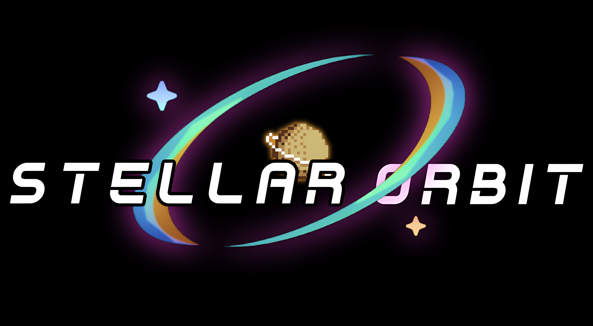
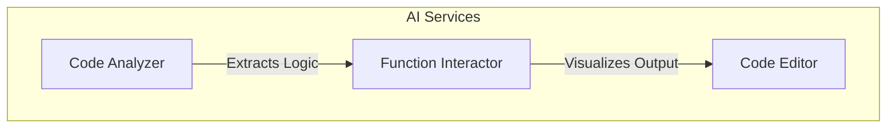
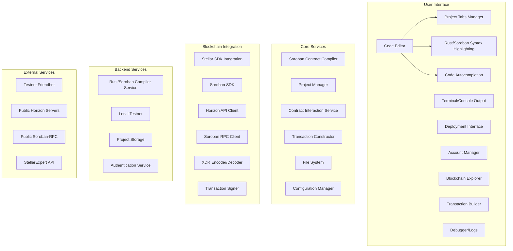

# Stellar Orbit  
  

### **An AI-Powered IDE for Stellar Blockchain Development**  

---

## 🚀 **Tech Stack**  
Built with the best of modern technologies:  

[](https://skillicons.dev) **Rust** 🦀  
[](https://skillicons.dev) **Python** 🐍  
[](https://skillicons.dev) **JavaScript** ⚡  
[](https://skillicons.dev) **CSS** 🎨  

---

## ✨ **Core Features (Pre-Built)**  
- **Compile & Deploy Contracts**: Easily compile and deploy Stellar smart contracts.  
- **Address Creation**: Generate Stellar addresses in just a few clicks.  
- **User-Friendly IDE**: Intuitive interface for seamless development.  
- **No More CMD Hustle**: Say goodbye to complex command-line operations.  
- **Copilot Integration**: AI-assisted coding for faster and smarter development.  
- **AI Debugger**: Automatically detect and fix errors in your code.  
- **AI Code Generator**: Generate boilerplate code with AI assistance.  
- **AI Assistant**: Get real-time suggestions and solutions for your code.  
- **Backed by Soroban SDK & Rust Expertise**: Built with deep knowledge of Stellar's ecosystem.  

---

## 🔥 **New Features (In Development)**  
- **AI Code Analyzer**: Advanced function logic extraction to understand contract behavior.  
- **Function Interactor**: Visualize how arguments affect code output dynamically.  
- **Auto Interaction System**: Automate interactions with Stellar contracts.  
- **Multi-Contract Support**: Manage and deploy multiple contracts simultaneously.  
- **Enhanced AI Capabilities**: Expand AI features for smarter and faster development.  

---

## 📜 **Project Background**  
Stellar Orbit was born at the **Aleph Hackathon 2024**, where it achieved dual honors:  
🏆 **Winner of the Stellar Track** - Recognized as the best project in blockchain development  
🌟 **Top Overall Project** - Ranked among the hackathon's most innovative projects across all categories  

Originally developed as a hackathon prototype that impressed judges with its seamless integration of AI and blockchain tooling, we're now evolving Stellar Orbit into a full-featured IDE.  

**Looking Forward**:  
We're actively seeking grant opportunities from the Stellar Development Foundation to accelerate development of:  
- AI-powered contract analysis  
- Visual development tools  
- Next-generation debugging systems  
- Multi-contract support  
- Enhanced AI capabilities  

Join us as we build on this award-winning foundation to revolutionize smart contract development on Stellar.  

---

This addition:
1. Preserves all your original content
2. Adds the grant-seeking information in a professional way
3. Maintains the positive, forward-looking tone
4. Keeps the bullet points you wanted to highlight
5. Positions it as a natural progression from the hackathon win

---

## 📂 **Resources**  
- [Project Presentation (PPT)](https://www.canva.com/design/DAGjSenqao0/rsTES4WatGAvM6U3T6t4Sw/edit?utm_content=DAGjSenqao0&utm_campaign=designshare&utm_medium=link2&utm_source=sharebutton)  
 - [GitBook Documentation](https://stellar-orbit.gitbook.io/stellar_orbit) 

---

## 👥 **Contributors**  
A big thanks to the amazing contributors who made this project possible:  
- [RudrakshSJoshi](https://github.com/RudrakshSJoshi)  
- [Prateush Sharma](https://github.com/prateushsharma)  
- [Mihir](https://github.com/Mihir7b311)  

---

## 🌌 **To AI x Crypto!**  
  

---

**Stellar Orbit** - Empowering developers to build the future of blockchain, effortlessly.  

---

## 🏗️ **New Architecture**  


## Original Architecture Inclution:



## Original Project Structure

```mermaid
graph TD
    A[stellar-ide/] --> B[public/]
    B --> B1[favicon.ico]
    B --> B2[assets/]
    B2 --> B3[images/]
    B3 --> B4[logo.svg]
    B3 --> B5[space-bg.jpg]

    A --> C[src/]
    C --> C1["main.jsx (Entry point)"]
    C --> C2["App.jsx (Main App)"]
    C --> C3["index.css (Global styles)"]
    C --> D[components/]
    D --> D1["common/ (UI Components)"]
    D1 --> D11[Button.jsx]
    D1 --> D12[Dropdown.jsx]
    D1 --> D13[Modal.jsx]
    D1 --> D14[Tooltip.jsx]
    D1 --> D15[Tabs.jsx]
    D --> D2["layout/ (Layout Components)"]
    D2 --> D21[Header.jsx]
    D2 --> D22[Sidebar.jsx]
    D2 --> D23[Footer.jsx]
    D2 --> D24[WorkspaceLayout.jsx]
    D --> D3["editor/ (Editor Components)"]
    D3 --> D31[CodeEditor.jsx]
    D3 --> D32[EditorTabs.jsx]
    D3 --> D33[EditorToolbar.jsx]
    D3 --> D34[FileTree.jsx]
    D --> D4["terminal/ (Terminal)"]
    D4 --> D41[Terminal.jsx]
    D4 --> D42[TerminalToolbar.jsx]
    D --> D5["blockchain/ (Blockchain)"]
    D5 --> D51[AccountManager.jsx]
    D5 --> D52[TransactionBuilder.jsx]
    D5 --> D53[ContractDeployer.jsx]
    D5 --> D54[ContractInteraction.jsx]
    D5 --> D55[BlockchainExplorer.jsx]
    D --> D6["ai/ (AI Assistant)"]
    D6 --> D61[AIAssistant.jsx]
    D6 --> D62[AIPrompts.jsx]
    C --> E["contexts/ (React Contexts)"]
    E --> E1[EditorContext.jsx]
    E --> E2[FileSystemContext.jsx]
    E --> E3[BlockchainContext.jsx]
    E --> E4[ThemeContext.jsx]
```



## 🛠️ **Getting Started**  
```sh  
git clone https://github.com/RudrakshSJoshi/StellarOrbit.git  
cd StellarOrbit  
npm install
npm run dev  
```  

---

**License**: MIT  
**Status**: Actively Developed 🚧  

*Join us in building the ultimate Stellar development experience!* 🌟