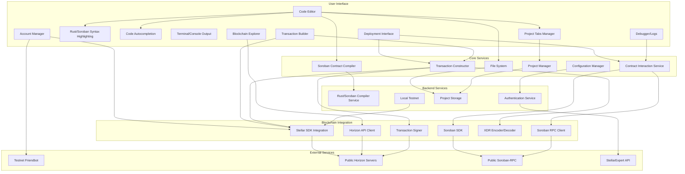

## Architecture

```mermaid
flowchart TD
    subgraph "User Interface"
        UI_EDITOR[Code Editor] --> UI_TABS[Project Tabs Manager]
        UI_EDITOR --> UI_SYNTAX[Rust/Soroban Syntax Highlighting]
        UI_EDITOR --> UI_AUTOCOMPLETE[Code Autocompletion]
        UI_TERMINAL[Terminal/Console Output]
        UI_DEPLOY[Deployment Interface]
        UI_ACCOUNTS[Account Manager]
        UI_EXPLORER[Blockchain Explorer]
        UI_BUILDER[Transaction Builder]
        UI_DEBUG[Debugger/Logs]
    end
    
    subgraph "Core Services"
        CS_COMPILER[Soroban Contract Compiler]
        CS_PROJECT[Project Manager]
        CS_INTERACT[Contract Interaction Service]
        CS_TX[Transaction Constructor]
        CS_FS[File System]
        CS_CONFIG[Configuration Manager]
    end
    
    subgraph "Blockchain Integration"
        BI_SDK[Stellar SDK Integration]
        BI_SOROBAN[Soroban SDK]
        BI_HORIZON[Horizon API Client]
        BI_RPC[Soroban RPC Client]
        BI_XDR[XDR Encoder/Decoder]
        BI_SIGNER[Transaction Signer]
    end
    
    subgraph "Backend Services"
        BS_COMPILE[Rust/Soroban Compiler Service]
        BS_TESTNET[Local Testnet]
        BS_STORAGE[Project Storage]
        BS_AUTH[Authentication Service]
    end
    
    subgraph "External Services"
        ES_FRIENDBOT[Testnet Friendbot]
        ES_PUBLIC_HORIZON[Public Horizon Servers]
        ES_PUBLIC_RPC[Public Soroban-RPC]
        ES_STELLAREXPERT[StellarExpert API]
    end
    
    %% UI connections
    UI_EDITOR --> CS_COMPILER
    UI_EDITOR --> CS_FS
    UI_DEPLOY --> CS_INTERACT
    UI_DEPLOY --> CS_TX
    UI_ACCOUNTS --> BI_SDK
    UI_EXPLORER --> BI_HORIZON
    UI_BUILDER --> BI_SDK
    UI_BUILDER --> CS_TX
    UI_DEBUG --> CS_INTERACT
    UI_TABS --> CS_PROJECT
    
    %% Core service connections
    CS_COMPILER --> BS_COMPILE
    CS_INTERACT --> BI_SOROBAN
    CS_INTERACT --> BI_RPC
    CS_TX --> BI_SDK
    CS_TX --> BI_XDR
    CS_TX --> BI_SIGNER
    CS_FS --> BS_STORAGE
    CS_PROJECT --> BS_STORAGE
    CS_CONFIG --> BS_AUTH
    
    %% Blockchain integration connections
    BI_SDK --> ES_PUBLIC_HORIZON
    BI_SOROBAN --> ES_PUBLIC_RPC
    BI_HORIZON --> ES_PUBLIC_HORIZON
    BI_RPC --> ES_PUBLIC_RPC
    BI_SIGNER --> ES_PUBLIC_HORIZON
    
    %% Backend connections
    BS_TESTNET --> BI_SDK
    BS_AUTH --> ES_STELLAREXPERT
    
    %% External connections
    UI_ACCOUNTS --> ES_FRIENDBOT
```
