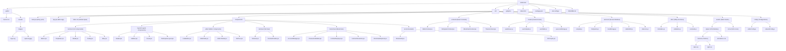

## Project Structure

```mermaid
graph TD
    A[stellar-ide/] --> B[public/]
    B --> B1[favicon.ico]
    B --> B2[assets/]
    B2 --> B3[images/]
    B3 --> B4[logo.svg]
    B3 --> B5[space-bg.jpg]

    A --> C[src/]
    C --> C1["main.jsx (Entry point)"]
    C --> C2["App.jsx (Main App)"]
    C --> C3["index.css (Global styles)"]
    
    C --> D[components/]
    D --> D1["common/ (UI Components)"]
    D1 --> D11[Button.jsx]
    D1 --> D12[Dropdown.jsx]
    D1 --> D13[Modal.jsx]
    D1 --> D14[Tooltip.jsx]
    D1 --> D15[Tabs.jsx]
    
    D --> D2["layout/ (Layout Components)"]
    D2 --> D21[Header.jsx]
    D2 --> D22[Sidebar.jsx]
    D2 --> D23[Footer.jsx]
    D2 --> D24[WorkspaceLayout.jsx]
    
    D --> D3["editor/ (Editor Components)"]
    D3 --> D31[CodeEditor.jsx]
    D3 --> D32[EditorTabs.jsx]
    D3 --> D33[EditorToolbar.jsx]
    D3 --> D34[FileTree.jsx]
    
    D --> D4["terminal/ (Terminal)"]
    D4 --> D41[Terminal.jsx]
    D4 --> D42[TerminalToolbar.jsx]
    
    D --> D5["blockchain/ (Blockchain)"]
    D5 --> D51[AccountManager.jsx]
    D5 --> D52[TransactionBuilder.jsx]
    D5 --> D53[ContractDeployer.jsx]
    D5 --> D54[ContractInteraction.jsx]
    D5 --> D55[BlockchainExplorer.jsx]
    
    D --> D6["ai/ (AI Assistant)"]
    D6 --> D61[AIAssistant.jsx]
    D6 --> D62[AIPrompts.jsx]
    
    C --> E["contexts/ (React Contexts)"]
    E --> E1[EditorContext.jsx]
    E --> E2[FileSystemContext.jsx]
    E --> E3[BlockchainContext.jsx]
    E --> E4[ThemeContext.jsx]
    
    C --> F["hooks/ (Custom Hooks)"]
    F --> F1[useMonaco.js]
    F --> F2[useCompiler.js]
    F --> F3[useStellar.js]
    F --> F4[useLocalStorage.js]
    
    C --> G["services/ (Service Modules)"]
    G --> G1[compiler.js]
    G --> G2[fileSystem.js]
    G --> G3[localStorage.js]
    G --> G4[stellarSDK.js]
    G --> G5[aiService.js]
    
    C --> H["utils/ (Utility Functions)"]
    H --> H1[formatters.js]
    H --> H2[validators.js]
    H --> H3[constants.js]
    
    C --> I["assets/ (Static Assets)"]
    I --> I1["styles/ (CSS Modules)"]
    I1 --> I11["themes/ (Themes)"]
    I11 --> I111[dark.css]
    I11 --> I112[light.css]
    I1 --> I12[animations.css]
    I --> I2["icons/ (SVG Icons)"]
    
    C --> J["config/ (Configurations)"]
    J --> J1[editorConfig.js]
    J --> J2[networkConfig.js]
    
    A --> K[.gitignore]
    A --> L[index.html]
    A --> M[package.json]
    A --> N[vite.config.js]
    A --> O[README.md]
```

